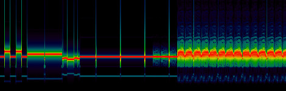
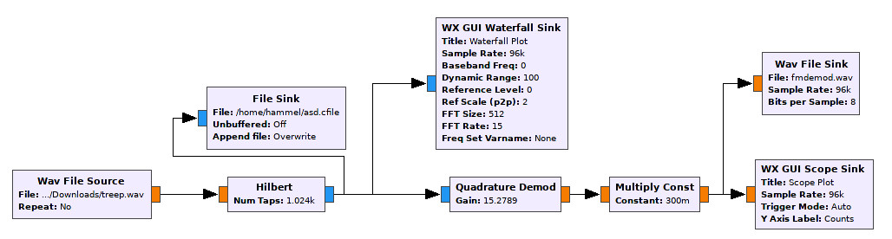
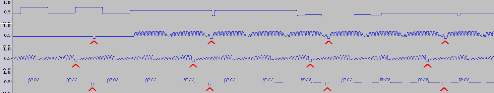
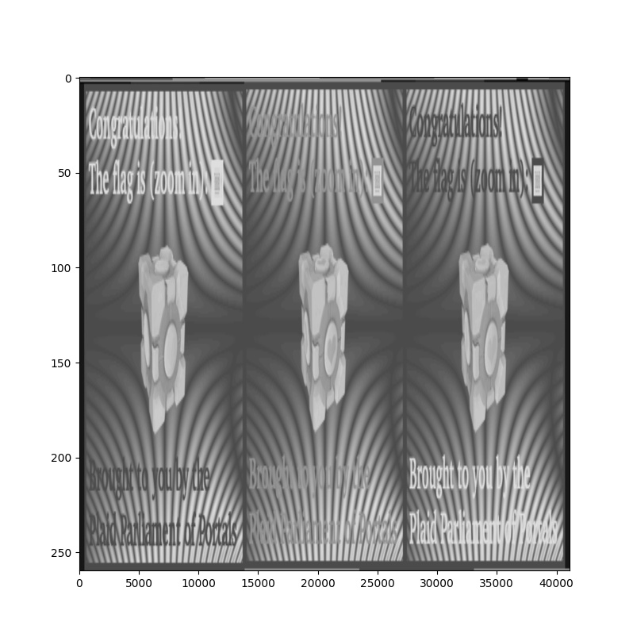
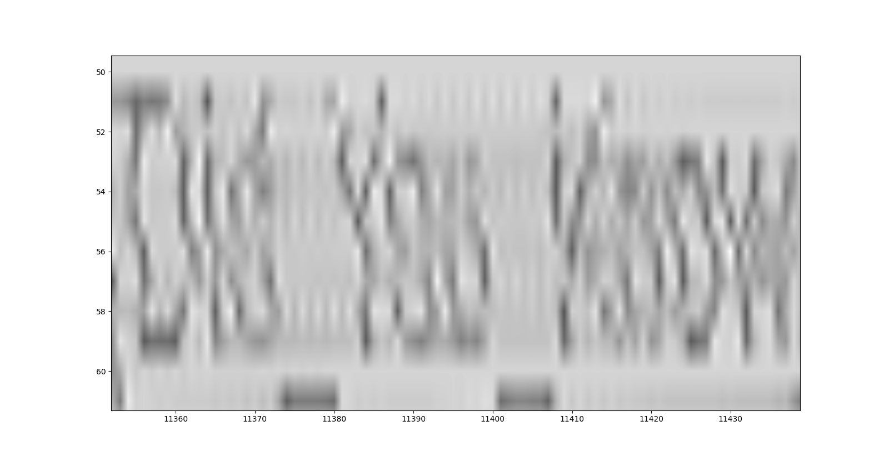

# Terebeep

### Short Description
High resolution SSTV

### Setp 1: Demodulation
After listening to the wav file, we viewed the spectrogram of the signal in Inspectrum.
The image shows the beginning of the .wav File.



It seems, that there is one carrier of non constant frequency, what would be an indicator for Frequency Modulation.
Next we tried to demodulate the Signal using GNURadio.
First the real signal has to be transformed to a complex one using the Hilbert Transform.
To achieve better results, we used a very large window size of 1024 as smaler create additional noise on the signal, that woulkd cause problems later.
The complex signal is then frequency demodulated using the "Qadrature Demod" block and the result is written to a .wav file.



The deomdulated signal was then analyzed in Audacity, which shows a somehow structured signal.
Even though this seems to be no digital modulation we know.



### Setp 2: Convert to an Image
We noticed periodic dips in the signal encapsulating a pattern repeating 3 times.
At some point we cam up with the idea, that these dips (sounds like 'clicks' in the original signal) could be a clock signal for the beginning of a row of an image.
We tried to split the signal into individual rows and visualize them using the following script.

```python
from scipy.io.wavfile import read
import numpy as np
import pylab as plt
import top_block as tb

tb.main()
plt.ion()
plt.set_cmap("gray")
a = read("fmdemod.wav")
x = map(float, a[1])

while True:
    rowlen = 41109#int(raw_input("Rowlen: "))
    i = 10000#int(raw_input("Offset: "))
    img = []
    while i+rowlen < len(x):
        img += [x[i:i+rowlen]]
        i += rowlen

    img = np.array(img)
    plt.imshow(img, interpolation='bilinear', aspect='auto')
    plt.draw()
```

By experimenting with the parameters, an image is visible with separated RGB channels \o/



By zooming in we can barely read the Flag: PCTF{Did_You_Know_the_ISS_Sends_Slow_Scan_TV_Images?_506063fd}



# Files
- [Original WAV](terebeep.wav)
- [GNURadio flowgraph](demod.grc)
- [Compiled top block](top_block.py)
- [Toplevel script](plot.py)
